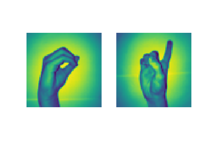

# Sign language analysis

Breve introduzione all'utilizzo della rete ANN con e senza la libreria keras

---

## Introduzione

Questa analisi si divide in due parti:
- l'implementazione di una Artificial Neural Network senza l'utilizzo della libreria `keras`
- l'implementazione della medesima rete con l'utilizzo della libreria `keras`

I dati analizzati provengono dal [sign-language-digits-dataset](https://www.kaggle.com/ardamavi/sign-language-digits-dataset/kernels) di Kaggle e contengono 2062 immagini rappresentanti i numeri da 0 a 9.

Io utilizzerò solamente i numeri 0 ed 1, 410 immagini in totale.

---

## Costruzione ANN senza `keras`

